# PlaySync - PlayStation Rental App 🎮

<div align="center">
  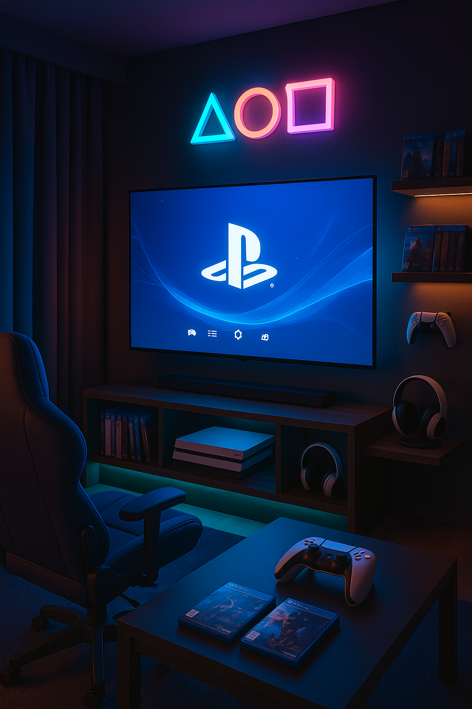
  
  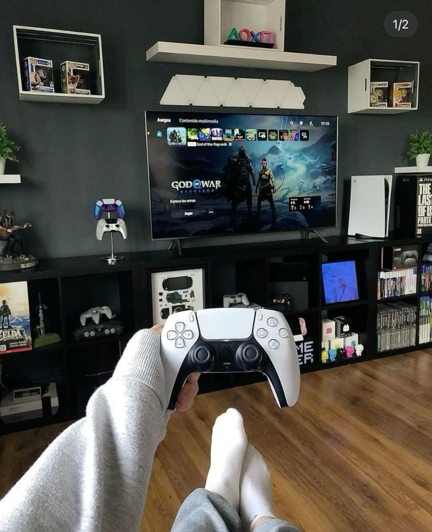
</div>

## 📱 About The Project

PlaySync is a mobile application designed to simplify the process of renting PlayStation gaming consoles. Built with Flutter, this cross-platform app provides a seamless experience for users to discover, book, and manage their PlayStation rental sessions.

### ✨ Features

- **Discover PlayStation Venues**: Browse through a curated list of PlayStation rental places
- **Real-time Availability**: Check available time slots for your favorite venues
- **Easy Booking**: Simple and intuitive booking process
- **Price Transparency**: Clear pricing with hourly rates for each venue
- **Venue Details**: View detailed information including facilities, ratings, and reviews
- **Booking History**: Keep track of your past and upcoming bookings
- **Responsive UI**: Beautiful and intuitive interface for all screen sizes

## 🛠️ Built With

- **Framework**: Flutter
- **State Management**: Built-in Flutter State Management
- **Local Storage**: Shared Preferences
- **UI/UX**: Material Design 3
- **Icons**: Material Icons

## 🚀 Getting Started

### Prerequisites

- Flutter SDK (latest stable version)
- Dart SDK
- Android Studio / Xcode (for emulator/simulator)
- VS Code or Android Studio (recommended IDEs)

### Installation

1. Clone the repository
   ```bash
   git clone https://github.com/yourusername/playsync.git
   cd playsync
   ```

2. Install dependencies
   ```bash
   flutter pub get
   ```

3. Run the app
   ```bash
   flutter run
   ```

## 📱 App Screens

| Splash Screen | Login | Register |
|--------------|--------|-----------|
| 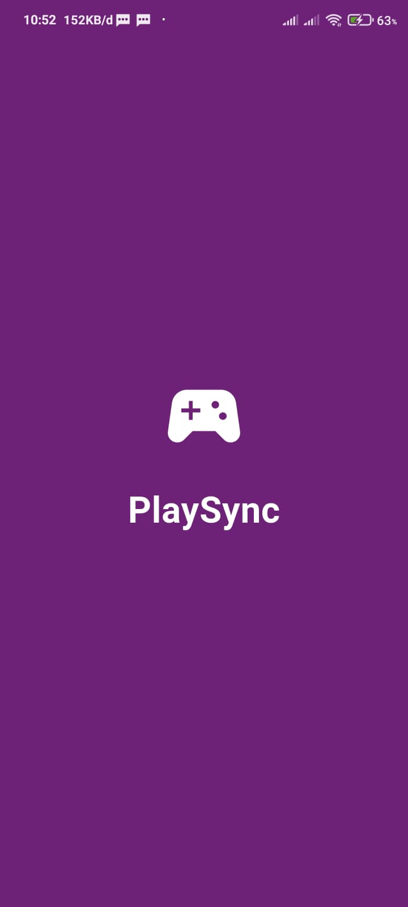 | 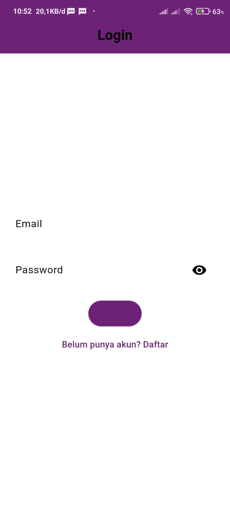 | 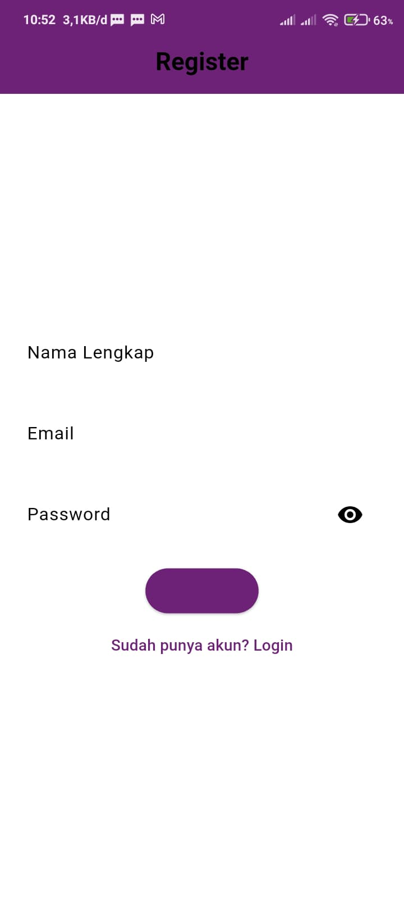 |

| Venue List | Venue Details | Booking |
|------------|----------------|----------|
| 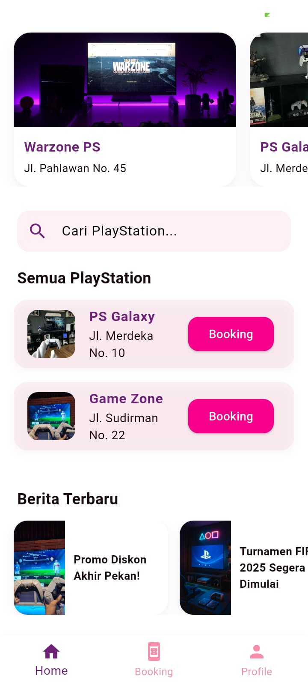 | 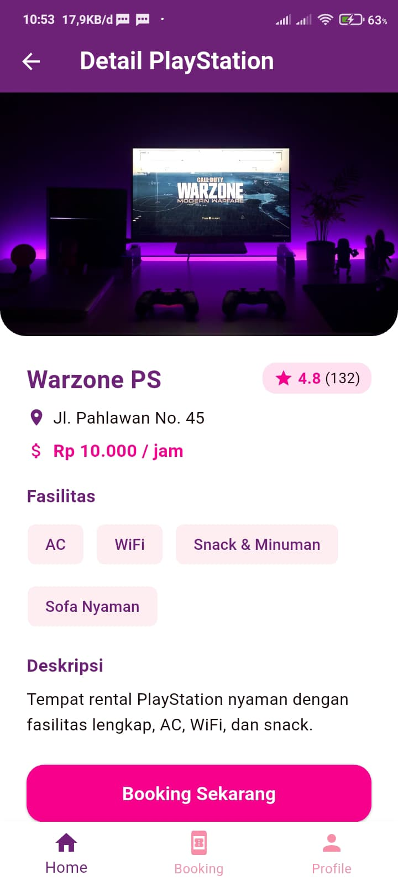 | 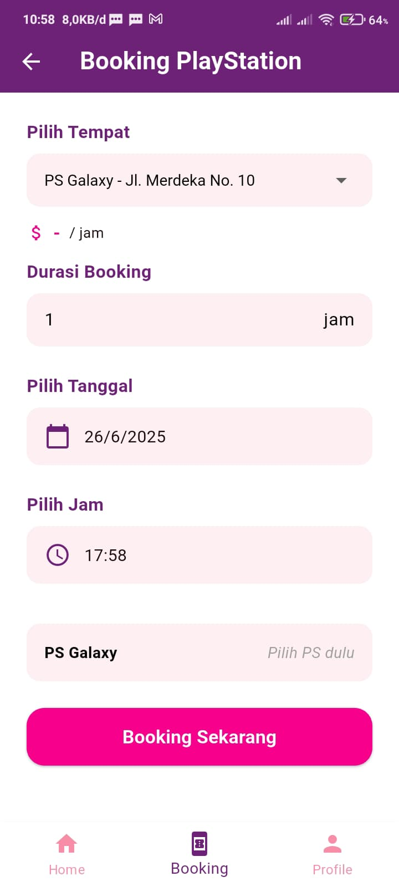 |

| Select Date | Select Time | Booking History |
|------------|--------------|-----------------|
| 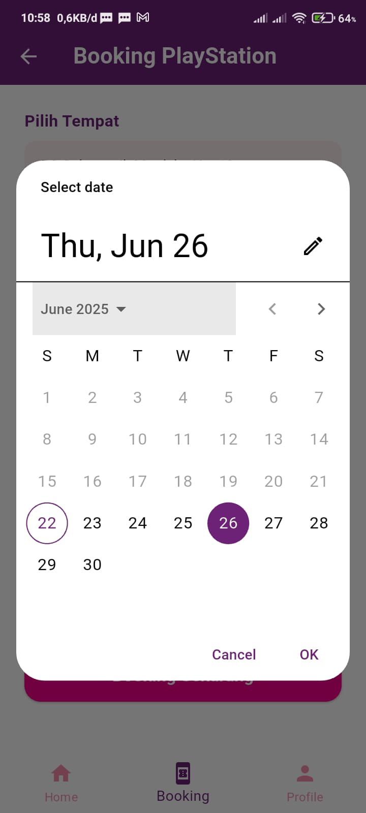 | 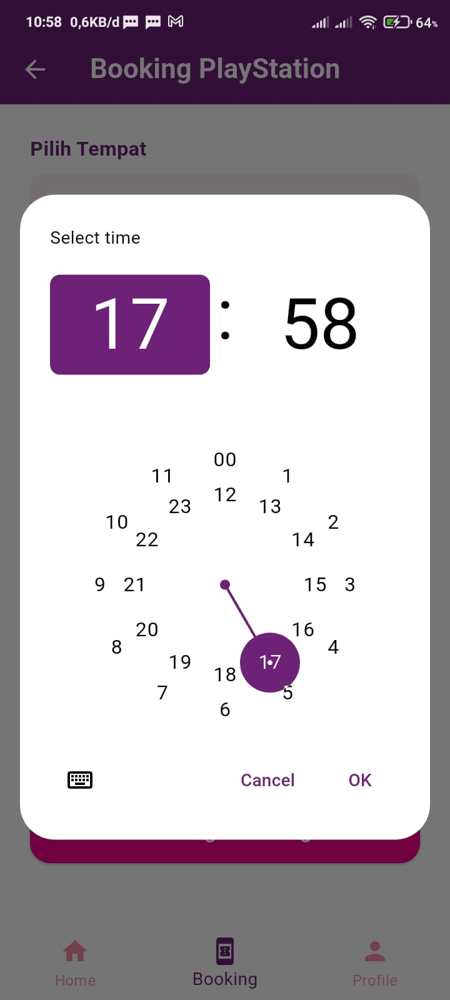 | 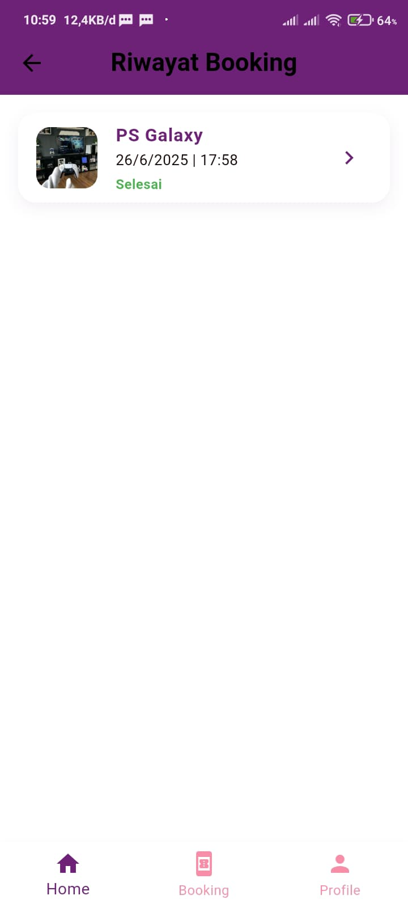 |

| Profile | | |
|----------|--|--|
| 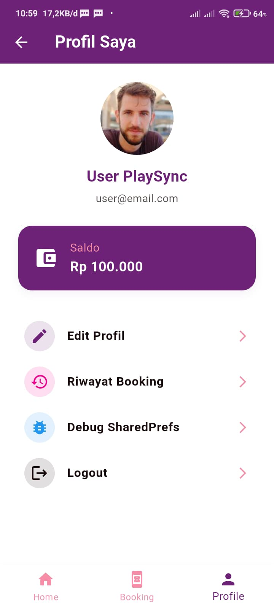 | | |


## 🎯 Key Features in Detail

### 1. User-Friendly Interface
- Clean and modern design following Material Design 3 guidelines
- Intuitive navigation with bottom navigation bar
- Responsive layout that works on various screen sizes

### 2. Venue Discovery
- Browse PlayStation venues with images and key information
- Filter venues by location, price, and rating
- View detailed information about each venue

### 3. Booking System
- Easy booking process with date and time selection
- Real-time availability checking
- Booking confirmation and notifications

## 🤝 Contributing

Contributions are what make the open-source community such an amazing place to learn, inspire, and create. Any contributions you make are **greatly appreciated**.

1. Fork the Project
2. Create your Feature Branch (`git checkout -b feature/AmazingFeature`)
3. Commit your Changes (`git commit -m 'Add some AmazingFeature'`)
4. Push to the Branch (`git push origin feature/AmazingFeature`)
5. Open a Pull Request

## 📝 License

Distributed under the MIT License. See `LICENSE` for more information.

## 👨‍💻 Author

**Diky Setiawan**  
📧 Email: achmaddikys21@gmail.com  
🔗 GitHub: [@dikysetiawan21](https://github.com/dikysetiawan21)  
💼 LinkedIn: [Achmad Diky Setiawan](linkedin.com/in/achmaddikysetiawan)

## 🙏 Acknowledgments

- [Flutter](https://flutter.dev/) - Beautiful native apps in record time
- [Material Design 3](https://m3.material.io/) - Design system
- [Font Awesome](https://fontawesome.com/) - For the beautiful icons

---

<div align="center">
  <p>Made with ❤️ by Diky Setiawan</p>
  <p>© 2025 PlaySync. All rights reserved.</p>
</div>
